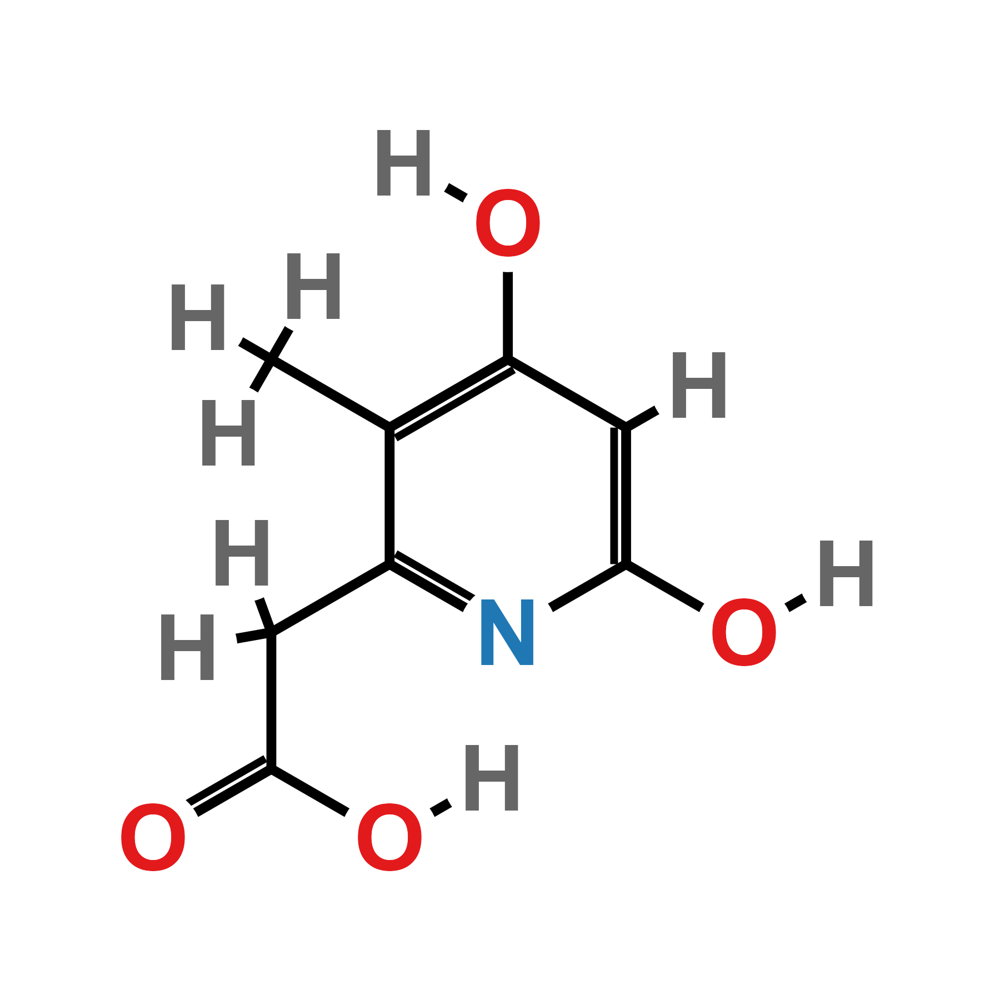
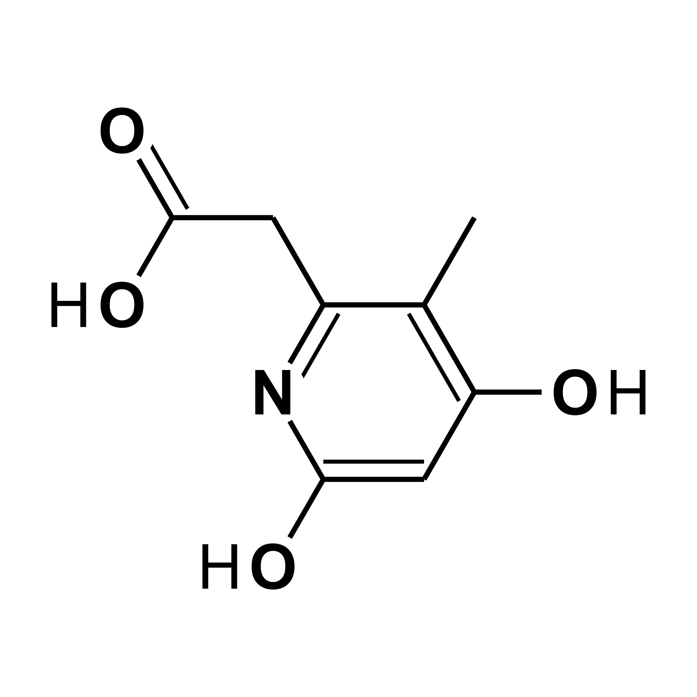

<!-- README.md is generated from README.Rmd. Please edit that file -->

```{r, include = FALSE}
knitr::opts_chunk$set(
  collapse = TRUE,
  comment = "#>",
  fig.path = "man/figures/ggchemplot_logo.png",
  out.width = "100%"
)
```

# ggchemplot: an R package for visualization of chemical structures

<!-- badges: start -->
<!-- badges: end -->

<table>
<tr>
<td width="65%">

`ggchemplot` is an extension of `ggplot2` designed for preparing publication-quality visualizations of chemical compounds.

</td>

<td width="35%" align="center">


</td>
</tr>
</table>

## Installation

You can install the development version of ggchemplot from [GitHub](https://github.com/) with:

``` r
# Install the remotes package if not already installed
install.packages("remotes")

# Install evobioqR from GitHub
remotes::install_github("JPFQueiroz/ggchemplot")
```

## Example

This is a basic example which shows you how to solve a common problem:

```{r example, fig.height=6, fig.width=6, message=FALSE, warning=FALSE, dpi=300}

# Load ggchemplot
library(ggchemplot)

# Parse SDF file and generate the initial data object
p1 <- ggchemplot1(sdf_file = "inst/extdata/P1.sdf")

# Save plot
ggplot2::ggsave(filename = "man/figures/ggchemplot_logo.pngexample-1.png", dpi = 300)

```

{width=50%}

```{r example-2, fig.height=6, fig.width=6, message=FALSE, warning=FALSE, dpi=300}

# Customize plot
p1 <- ggchemplot1(sdf_file = "inst/extdata/P1.sdf",
                  title = NULL,
                  collapse_hydrogens = TRUE,
                  rotation = 90,
                  label_padding = 1,
                  show_atom_circles = TRUE,
                  hide_carbon_circles = TRUE,
                  circle_stroke = 0,
                  show_atom_labels = TRUE,
                  hide_carbon_labels = TRUE,
                  bond_width = 2,
                  atom_size = 26, 
                  label_size = 18,
                  double_bond_offset = 0.3,
                  custom_atom_colors = NULL,
                  paint_it_black = TRUE,
                  H_offset = c(0.9, 1)
)

# Save plot
ggplot2::ggsave(filename = "man/figures/ggchemplot_logo.pngexample-2.png", dpi = 300)

```

{width=50%}

