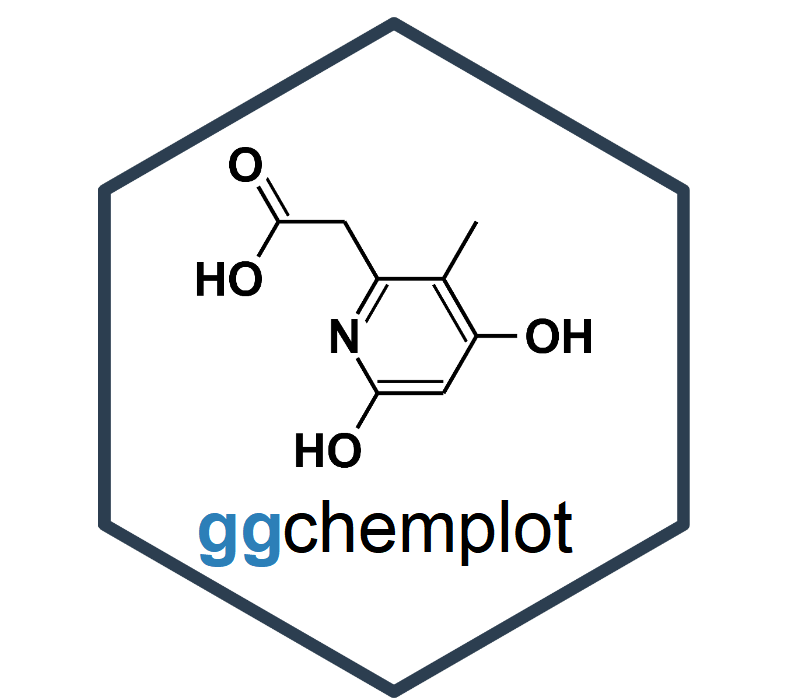
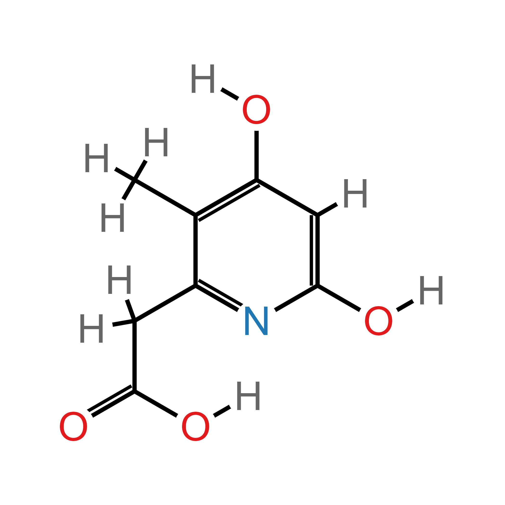
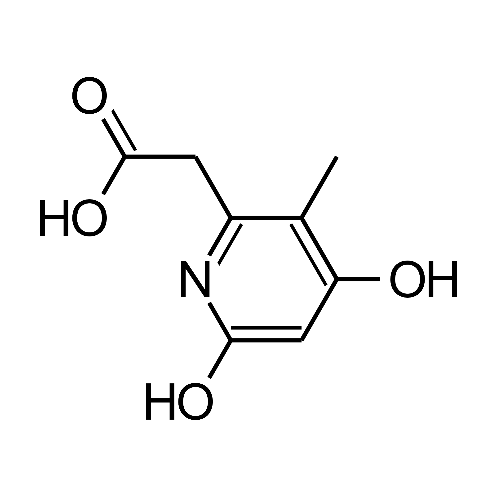
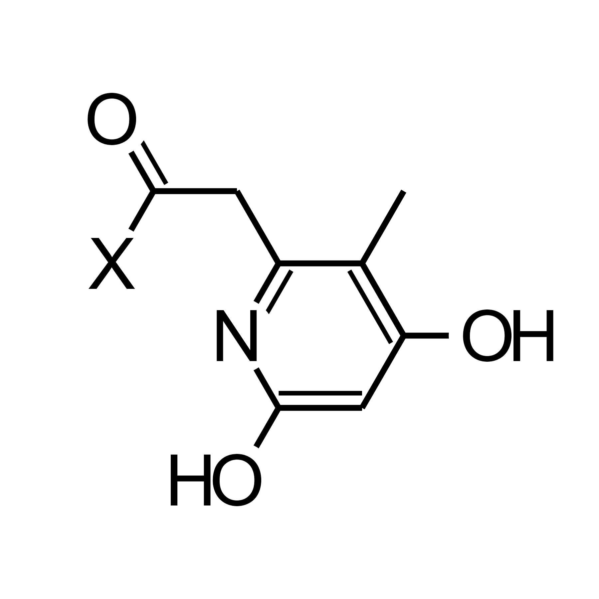
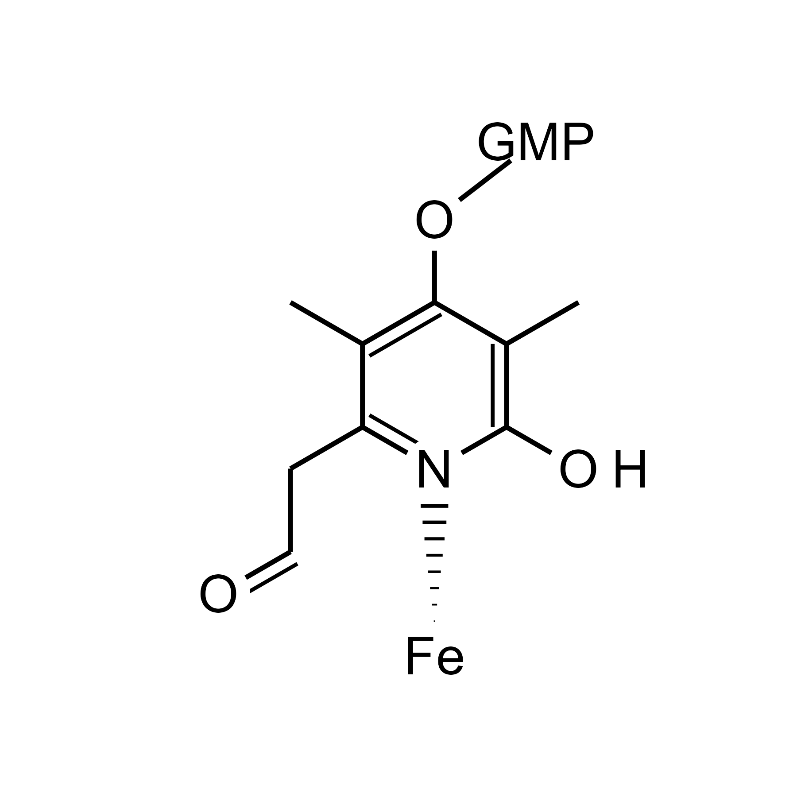

<!-- README.md is generated from README.Rmd. Please edit that file -->

```{r, include = FALSE}
knitr::opts_chunk$set(
  collapse = TRUE,
  comment = "#>",
  fig.path = "man/figures/ggchemplot_logo.png",
  out.width = "100%"
)
```

# ggchemplot: an R package for visualization of chemical structures

<!-- badges: start -->
<!-- badges: end -->

<table style="border: none;">
<tr style="border: none;">
<td width="65%" style="border: none; vertical-align: middle;">

`ggchemplot` is an extension of `ggplot2` designed for preparing publication-quality visualizations of chemical compounds.

</td>

<td width="35%" align="center" style="border: none;">



</td>
</tr>
</table>

## Installation

You can install the development version of `ggchemplot` from [GitHub](https://github.com/) with:

``` r
# Install the remotes package if not already installed
install.packages("remotes")

# Install evobioqR from GitHub
remotes::install_github("JPFQueiroz/ggchemplot")
```

## Example

The quick example below shows how to parse a SDF file and save a default visualization.  

```{r example, eval=FALSE, fig.height=6, fig.width=6, message=FALSE, warning=FALSE, dpi=300, include=TRUE}

# Load ggchemplot
library(ggchemplot)

# Parse SDF file and generate the initial data object
p1 <- ggchemplot1(sdf_file = "inst/extdata/P1.sdf")

# Save plot
ggplot2::ggsave(filename = "man/figures/ggchemplot_example1.png", 
                bg = "white",
                dpi = 300)

```

{width=50%}

The `ggchemplot1` function also allows some customization.  

```{r example-2, eval=FALSE, fig.height=6, fig.width=6, message=FALSE, warning=FALSE, dpi=300, include=TRUE}

# Customize plot
p1 <- ggchemplot1(sdf_file = "inst/extdata/P1.sdf",
                  title = NULL,
                  collapse_hydrogens = TRUE,
                  rotation = 90,
                  label_padding = 1,
                  show_atom_circles = TRUE,
                  hide_carbon_circles = TRUE,
                  circle_stroke = 0,
                  show_atom_labels = TRUE,
                  hide_carbon_labels = TRUE,
                  bond_width = 2,
                  atom_size = 26, 
                  label_size = 18,
                  double_bond_offset = 0.3,
                  custom_atom_colors = NULL,
                  paint_it_black = TRUE,
                  H_offset = c(0.85, 1)
)

# Save plot
ggplot2::ggsave(filename = "man/figures/ggchemplot_example2.png", 
                bg = "white",
                dpi = 300)

```

{width=50%}

Helper functions use the output returned by `ggchemplot1` to modify the data, which allows the user to polish the visualization before the final plot with `ggchemplot2`.  

```{r example-3, eval=FALSE, fig.height=6, fig.width=6, message=FALSE, warning=FALSE, dpi=300, include=TRUE}

library(ggchemplot)
library(dplyr)

# Parse the data and create initial plot
p1 <- ggchemplot1(sdf_file = "inst/extdata/P1.sdf",
                  title = NULL,
                  collapse_hydrogens = TRUE,
                  rotation = 90,
                  label_padding = 1,
                  show_atom_circles = TRUE,
                  hide_carbon_circles = TRUE,
                  circle_stroke = 0,
                  show_atom_labels = TRUE,
                  hide_carbon_labels = TRUE,
                  bond_width = 2,
                  atom_size = 26, 
                  label_size = 18,
                  double_bond_offset = 0.3,
                  custom_atom_colors = NULL,
                  paint_it_black = TRUE,
                  H_offset = c(0.9, 1)
)

# Visualizing atom and bond ids helps with the customization
p1 %>% ggchemplot2(show_ids = TRUE,
                  H_offset = c(0.85, 1))


# Example of modification: Change atom label
p1 %>% 
  change_label(atom_id = 4, new_label = "X") %>% 
  ggchemplot2(label_padding = 1,
              H_offset = c(0.95, 1))

# Save plot
ggplot2::ggsave(filename = "man/figures/ggchemplot_example3.png", 
                bg = "white",
                dpi = 300)

```

{width=50%}

The example below shows how an iron atom can be added below the pyridinol nitrogen, then connected through a hashed bond.  

```{r eval=FALSE, fig.height=6, fig.width=6, message=FALSE, warning=FALSE, dpi=300, include=TRUE}

library(ggchemplot)
library(dplyr)
library(ggplot2)
library(grid)

p1 <- ggchemplot1(sdf_file = "inst/extdata/GP_pyridinol_acyl.sdf", 
                  collapse_hydrogens = TRUE,
                  rotation = 0,
                  atom_size = 16, 
                  label_size = 10,
                  label_padding = 1,
                  paint_it_black = TRUE,
                  double_bond_offset = 0.24,
                  bond_width = 1.25
                  )

p1 %>%
  change_label(atom_id = 14, new_label = "GMP") %>%
  add_atom(x = p1$atoms$x[3], y = p1$atoms$y[3] - 3.25, symbol = "Fe") %>% 
  add_hashed_bond(from_id = 15, to_id = 3, width = 0.28, 
                  shorten = c(0.5, 0.5), colour = "black", 
                  wedge_thickness = .25, n_hashes = 8) %>% 
  ggchemplot2(H_offset = c(0.9, 1))

# Save plot
ggplot2::ggsave(filename = "man/figures/ggchemplot_example4.png", 
                bg = "white",
                dpi = 300)

```

{width=50%}

